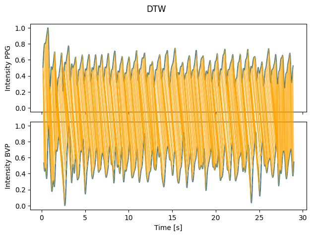
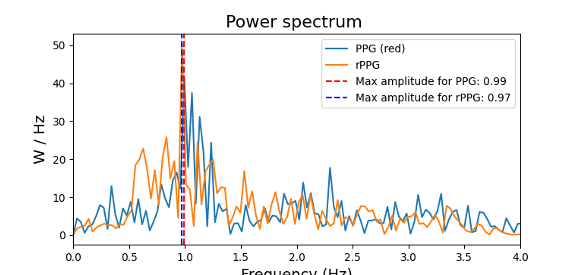

# MAIN_GUI_PI

The files heartrate_monitor, hrcalc and max30102 were not changed and just taken as is form the Kiosk at BMHT ETH Zürich.
The BVP_Analysis file contains the Pipeline form pyVHR with slight changes to return the BVP for further analysis.

## Results




## Structure
Here all functions are listed.

```bash
Main_GUI_Pi/
│
│
├── Analysis_GUI/
│   └── HeartRateAnalyzer
│        ├── initUI
│        └── analyze
│
│
├── BVP_Analysis/
│   ├── get_frame_timestamps
│   ├── calculate_frame_rate
│   ├── visualize_BVPs
│   ├── PPG_data
│   ├── BVP_data
│   ├── peakfinder_rppg
│   ├── normalize
│   ├── plot_warping
│   ├── DTW_analysis
│   ├── analysis
│   └── Pipeline_analysis
│        └── run_on_video
│
│
├── Main_GUI/
│   └── HeartRateAnalyzer
│        ├── initUI
│        └── start_program
│
│
├── heartrate_monitor/
│   └── HeartRateMonitor
│        ├── run_sensor
│        ├── start_sensor
│        └── stop_sensor
│
│
├── hrcalc/
│   ├── calc_hr_and_spo2
│   ├── find_peaks
│   ├── find_peaks_above_min_height
│   └── Pipeline_analysis
│
│
└── max30102/
     └── MAX30102
          ├── shutdown
          ├── reset
          ├── setup
          ├── set_config
          ├── get_data_present
          ├── read_fifo
          └── read_sequential

```
