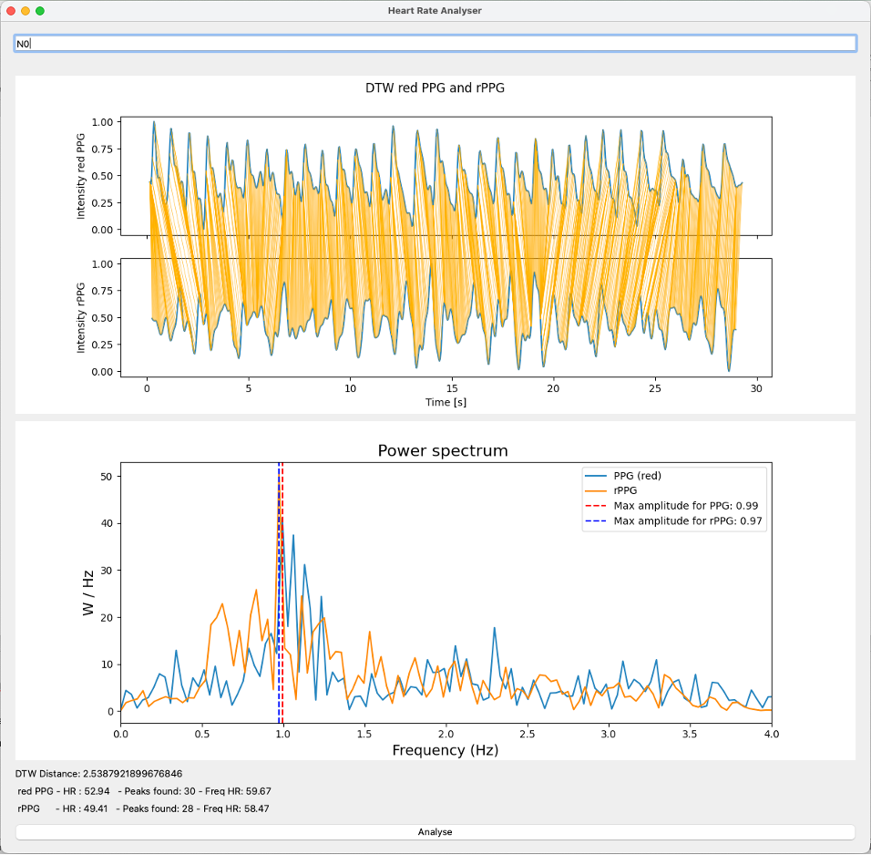

# Raspi_cardiac_wave
Mobile Platform to detect cardiac waveform remotely

[](https://www.python.org/downloads/release/python-3110/)
[](https://pypi.org/project/pyVHR/)


## Summary
Contained are the 3 parts. First the GUI for video and PPG recording on the raspberry pi with data analysis. Second a GUI for analysing the data on the MacBook. Those two use the package pyVHR for the information extraction. Thrid a Notebook to generate teh features and the code to train and test a random forest classifier to predict the Video success.

## Description:

This project aims to leverage the capabilities of a Raspberry Pi 4 along with a camera and a pulse oximeter to compare the reliability of remote Photoplethysmography (rPPG) with traditional Pulse Oximetry (PPG). The Raspberry Pi 4, equipped with a camera module, captures facial video data, enabling the extraction of subtle changes in skin color associated with blood perfusion. Simultaneously, a pulse oximeter records the conventional PPG signal for comparison.

The first phase involves processing the captured video data to extract rPPG signals using pyVHR.

In the subsequent phase, a comparative analysis is conducted between the rPPG and PPG signals to evaluate their accuracy and consistency in measuring physiological parameters, such as heart rate and oxygen saturation levels.

In the final part of the project, a Random Forest Classifier is implemented to predict the reliability of obtaining accurate pulse data from a given video. Various features extracted from the video data, such as motion artifacts, lighting conditions, and movement, are utilised as input to the classifier. By training the classifier on a dataset containing labeled examples of successful and unsuccessful pulse data extraction, the system can predict the likelihood of obtaining accurate pulse readings from new video inputs.

Overall, this project provides insights into the feasibility of using rPPG techniques as a non-contact alternative to traditional PPG measurements on mobile platforms, with the added capability of predicting the success of pulse data extraction from video recordings using machine learning algorithms.

### Folder Structure
In the Main_GUI_Pi folder all files for the Raspberry Pi are stored. The Analysis_GUI is also usable on the PC since it does not contain the Video and PPG recording part but only the analysis. In the Video Success folder the code for feature extraction from the video is presented. Also the code used to build the Random Forest classifier.

Additional information can be found in the folders. 

## GUI
The GUI was realised with pyQT5.


## Raspberry Pi


## Package Requirements Raspberry Pi
The following list displays the installed packages required for the system to function properly. Please note that while all listed packages are installed, not all of them may be necessary for the operation of the system. Additionally, the displayed versions do work with each other, although they may not be optimized for maximum performance.

- absl-py==2.0.0
- Adafruit-Blinka==8.25.0
- adafruit-circuitpython-busdevice==5.2.6
- adafruit-circuitpython-mlx90640==1.3.0
- adafruit-circuitpython-register==1.9.17
- adafruit-circuitpython-requests==2.0.2
- adafruit-circuitpython-typing==1.9.5
- Adafruit-PlatformDetect==3.54.0
- Adafruit-PureIO==1.1.11
- arandr==0.1.11
- asgiref==3.6.0
- asteval==0.9.31
- astroid==2.14.2
- asttokens==2.2.1
- astunparse==1.6.3
- attrs==23.1.0
- autorank==1.1.3
- av==10.0.0
- Babel==2.10.3
- baycomp==1.0.3
- beautifulsoup4==4.11.2
- beniget==0.4.1
- bidict==0.22.1
- biosppy==0.7.3
- blinker==1.5
- board==1.0
- cachetools==5.3.2
- certifi==2022.9.24
- cffi==1.16.0
- chardet==5.1.0
- charset-normalizer==3.0.1
- click==8.1.3
- colorama==0.4.6
- colorzero==2.0
- comm==0.2.0
- contourpy==1.2.0
- cryptography==38.0.4
- cupshelpers==1.0
- cycler==0.12.1
- Cython==3.0.5
- dbus-python==1.3.2
- decorator==5.1.1
- dill==0.3.6
- distro==1.8.0
- docutils==0.19
- dtaidistance==2.3.11
- executing==2.0.1
- filelock==3.13.1
- Flask==2.2.2
- flatbuffers==20181003210633
- fonttools==4.44.0
- fsspec==2023.10.0
- future==0.18.3
- gast==0.5.4
- gdown==4.7.1
- google-auth==2.23.4
- google-auth-oauthlib==1.0.0
- google-pasta==0.2.0
- gpiozero==2.0
- grpcio==1.59.2
- h5py==3.10.0
- heartpy==1.2.7
- html5lib==1.1
- idna==3.3
- imageio==2.32.0
- imageio-ffmpeg==0.4.9
- importlib-metadata==4.12.0
- install==1.3.5
- ipython==8.17.2
- ipywidgets==8.1.1
- isort==5.6.4
- itsdangerous==2.1.2
- jedi==0.18.2
- Jinja2==3.1.2
- joblib==1.3.2
- jupyterlab-widgets==3.0.9
- keras==2.14.0
- kiwisolver==1.4.5
- lazy-object-proxy==1.9.0
- lazy_loader==0.3
- lgpio==0.2.2.0
- libclang==16.0.6
- libevdev==0.5
- llvmlite==0.41.1
- lmfit==1.2.2
- logilab-common==1.9.8
- lxml==4.9.2
- Markdown==3.5.1
- MarkupSafe==2.1.2
- matplotlib==3.8.1
- matplotlib-inline==0.1.6
- mccabe==0.7.0
- mediapipe==0.10.8
- ml-dtypes==0.2.0
- more-itertools==8.10.0
- mpmath==1.3.0
- mypy==1.0.1
- mypy-extensions==0.4.3
- networkx==3.2.1
- numba==0.58.1
- numpy==1.26.2
- oauthlib==3.2.2
- olefile==0.46
- opencv-contrib-python==4.8.1.78
- opt-einsum==3.3.0
- packaging==23.2
- pandas==2.1.2
- parso==0.8.3
- patsy==0.5.3
- pexpect==4.8.0
- pgzero==1.2
- picamera==1.13
- picamera2==0.3.17
- pidng==4.0.9
- piexif==1.1.3
- pigpio==1.78
- Pillow==9.4.0
- platformdirs==2.6.0
- plotly==5.18.0
- ply==3.11
- prompt-toolkit==3.0.40
- protobuf==3.20.3
- psutil==5.9.4
- ptyprocess==0.7.0
- pure-eval==0.2.2
- pyasn1==0.5.0
- pyasn1-modules==0.3.0
- pycairo==1.20.1
- pycparser==2.21
- pycups==2.0.1
- pyftdi==0.55.0
- pygame==2.1.2
- Pygments==2.14.0
- PyGObject==3.42.2
- pyinotify==0.9.6
- PyJWT==2.6.0
- pylint==2.16.2
- PyOpenGL==3.1.6
- pyOpenSSL==23.0.0
- pyparsing==3.1.1
- PyQt5==5.15.9
- PyQt5-sip==12.11.1
- pyserial==3.5
- pysmbc==1.0.23
- PySocks==1.7.1
- python-apt==2.6.0
- python-dateutil==2.8
- python-dateutil==2.8.2
- python-dotenv==0.21.0
- python-prctl==1.8.1
- pythran==0.11.0
- pytz==2022.7.1
- pyudev==0.24.0
- pyusb==1.2.1
- pyVHR-cpu==1.0.2
- PyWavelets==1.4.1
- reportlab==3.6.12
- requests==2.28.1
- requests-oauthlib==1.3.0
- responses==0.18.0
- roman==3.3
- RPi.GPIO==0.7.1a4
- rsa==4.9
- RTIMULib==7.2.1
- scikit-image==0.20.0
- scikit-learn==1.3.2
- scikit-posthocs==0.8.0
- scipy==1.10.1
- seaborn==0.13.0
- Send2Trash==1.8.1b0
- sense-hat==2.6.0
- shortuuid==1.0.11
- simplejpeg==1.6.6
- simplejson==3.18.3
- six==1.16.0
- sklearn==0.0.post11
- smbus==1.1.post2
- smbus2==0.4.2
- sounddevice==0.4.6
- soupsieve==2.3.2
- spidev==3.5
- ssh-import-id==5.10
- stack-data==0.6.3
- statsmodels==0.14.0
- sympy==1.12
- tenacity==8.2.3
- tensorboard==2.14.1
- tensorboard-data-server==0.7.2
- tensorflow==2.14.0
- tensorflow-cpu-aws==2.14.0
- tensorflow-estimator==2.14.0
- tensorflow-io-gcs-filesystem==0.34.0
- termcolor==2.3.0
- thonny==4.1.4
- threadpoolctl==3.2.0
- tifffile==2023.9.26
- toml==0.10.2
- tomlkit==0.11.7
- torch==2.1.1
- torchvision==0.16.0
- tqdm==4.66.1
- traitlets==5.13.0
- twython==3.8.2
- types-aiofiles==22.1
- types-annoy==1.17
- types-appdirs==1.4
- types-aws-xray-sdk==2.10
- types-babel==2.11
- types-backports.ssl-match-hostname==3.7
- types-beautifulsoup4==4.11
- types-bleach==5.0
- types-boto==2.49
- types-braintree==4.17
- types-cachetools==5.2
- types-caldav==0.10
- types-certifi==2021.10.8
- types-cffi==1.15
- types-chardet==5.0
- types-chevron==0.14
- types-click-spinner==0.1
- types-colorama==0.4
- types-commonmark==0.9
- types-console-menu==0.7
- types-contextvars==2.4
- types-croniter==1.3
- types-cryptography==3.3
- types-D3DShot==0.1
- types-dateparser==1.1
- types-DateTimeRange==1.2
- types-decorator==5.1
- types-Deprecated==1.2
- types-dj-database-url==1.0
- types-docopt==0.6
- types-docutils==0.19
- types-editdistance==0.6
- types-emoji==2.1
- types-entrypoints==0.4
- types-first==2.0
- types-flake8-2020==1.7
- types-flake8-bugbear==22.10.27
- types-flake8-builtins==2.0
- types-flake8-docstrings==1.6
- types-flake8-plugin-utils==1.3
- types-flake8-rst-docstrings==0.2
- types-flake8-simplify==0.19
- types-flake8-typing-imports==1.14
- types-Flask-Cors==3.0
- types-Flask-SQLAlchemy==2.5
- types-fpdf2==2.5
- types-gdb==12.1
- types-google-cloud-ndb==1.11
- types-hdbcli==2.14
- types-html5lib==1.1
- types-httplib2==0.21
- types-humanfriendly==10.0
- types-invoke==1.7
- types-JACK-Client==0.5
- types-jmespath==1.0
- types-jsonschema==4.17
- types-keyboard==0.13
- types-ldap3==2.9
- types-Markdown==3.4
- types-mock==4.0
- types-mypy-extensions==0.4
- types-mysqlclient==2.1
- types-oauthlib==3.2
- types-openpyxl==3.0
- types-opentracing==2.4
- types-paho-mqtt==1.6
- types-paramiko==2.11
- types-parsimonious==0.10
- types-passlib==1.7
- types-passpy==1.0
- types-peewee==3.15
- types-pep8-naming==0.13
- types-Pillow==9.3
- types-playsound==1.3
- types-polib==1.1
- types-prettytable==3.4
- types-protobuf==3.20
- types-psutil==5.9
- types-psycopg2==2.9
- types-pyaudio==0.2
- types-PyAutoGUI==0.9
- types-pycurl==7.45
- types-pyfarmhash==0.3
- types-pyflakes==2.5
- types-Pygments==2.13
- types-pyinstaller==5.6
- types-PyMySQL==1.0
- types-pynput==1.7
- types-pyOpenSSL==22.1
- types-pyRFC3339==1.1
- types-PyScreeze==0.1
- types-pysftp==0.2
- types-pytest-lazy-fixture==0.6
- types-python-crontab==2.6
- types-python-dateutil==2.8
- types-python-gflags==3.1
- types-python-jose==3.3
- types-python-nmap==0.7
- types-python-slugify==6.1
- types-pytz==2022.6
- types-pyvmomi==7.0
- types-pywin32==304
- types-PyYAML==6.0
- types-redis==4.3
- types-regex==2022.10.31
- types-requests==2.28
- types-retry==0.9
- types-Send2Trash==1.8
- types-setuptools==65.5
- types-simplejson==3.17
- types-singledispatch==3.7
- types-six==1.16
- types-slumber==0.7
- types-SQLAlchemy==1.4.43
- types-stdlib-list==0.8
- types-stripe==3.5
- types-tabulate==0.9
- types-termcolor==1.1
- types-toml==0.10
- types-toposort==1.7
- types-tqdm==4.64
- types-tree-sitter==0.20
- types-tree-sitter-languages==1.5
- types-ttkthemes==3.2
- types-typed-ast==1.5
- types-tzlocal==4.2
- types-ujson==5.5
- types-urllib3==1.26
- types-vobject==0.9
- types-waitress==2.1
- types-whatthepatch==1.0
- types-xmltodict==0.13
- types-xxhash==3.0
- types-zxcvbn==4.4
- typing_extensions==4.4.0
- tzdata==2023.3
- uncertainties==3.1.7
- urllib3==1.26.12
- v4l2-python3==0.3.3
- wcwidth==0.2.9
- webencodings==0.5.1
- Werkzeug==2.2.2
- widgetsnbextension==4.0.9
- wrapt==1.14.1
- zipp==3.17.0


## Configuration

The code for the Raspberry Pi was tested on a Pi4 and Pi5. Other than that the code was run on a MacBook Pro M1.

## Structure
```bash
Raspi_cardiac_wave/
│
│
├── Main_GUI_Pi/
│   ├── Analysis_GUI.py
│   ├── BVP_Analysis.py
│   ├── Main_GUI.py
│   ├── heartrate_monitor.py
│   ├── hrcalc.py
│   └── max30102.py
│
├── Video Success/
│   ├── Classification.ipynb
│   ├── Data_Cutting.ipynb
│   └── Feature_generation-ipynb
│
├── Images/
│   ├── Analysis_GUI.PNG
│   ├── Case Assembled.jpg
│   ├── Feature_importance_all.png
│   ├── N5_DTW_result.png
│   └── fft_plot.png
│
├── Data/
│   ├── Model
│   ├── Training
│   └── Validation
│
├── README.md
│
└── Requirements
```
## License - MIT License.

### Contact
This work was carried out at the BMHT at ETH Zurich. 

If you have any questions, please feel free to contact morij@ethz.ch or moe.elgendi@hest.ethz.ch !


### Disclosure 
This project description was generated with assistance from an AI language model. While the content has been reviewed to ensure accuracy and coherence, it should be noted that AI technology was employed in its composition. Any potential errors or discrepancies are the responsibility of the user to verify.


