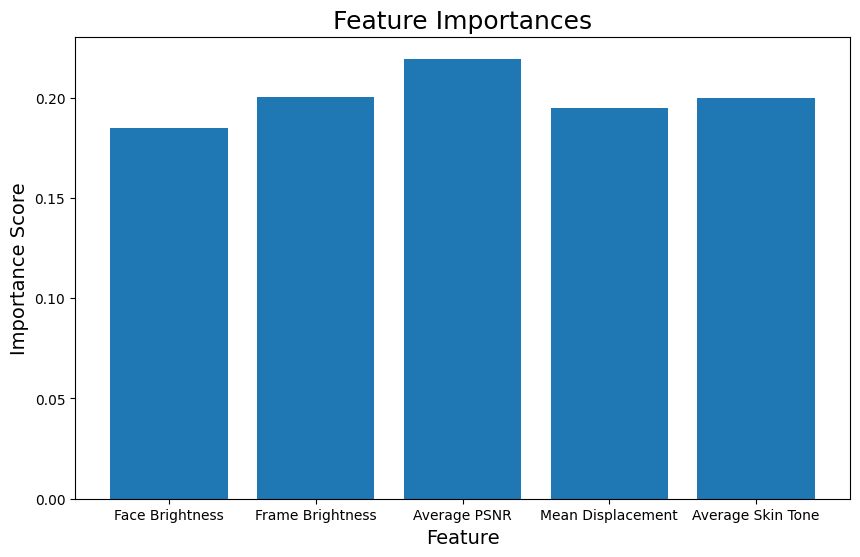
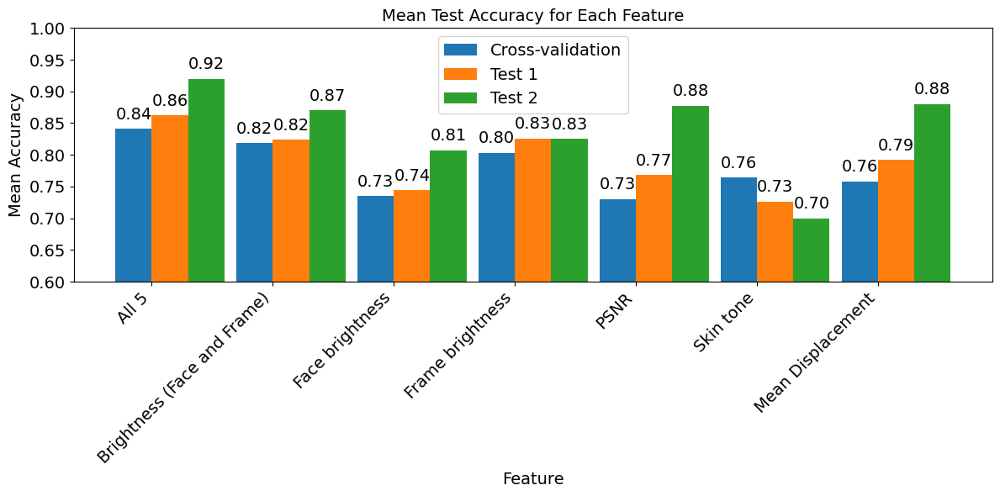

# Video Success

Using the notebooks in this folder, a classifier was trained to determine whether the video would give good results using the pyVHR pipeline, based on various features. 

## Features
- Brightness of the face: This measures the overall luminance or brightness level of the region
corresponding to the face within the video frame.
- Brightness of the whole frame: This represents the average brightness level across the entire video
frame, including all objects and regions.
- Average PSNR: (Peak Signal-to-Noise Ratio) measures the average quality of video reconstruction
between consecutive frames, indicating how closely the grey-level intensity of the current frame
matches the intensity of the previous frame, with higher values suggesting better fidelity.
- Mean feature displacements: This measures the average movement or displacement of certain
features, likely facial landmarks, across consecutive frames of the video.
- Face skin tone: This represents the average skin colour tone within the face region of the video
frame, typically represented in terms of hue, saturation, and value.

## Results
The following table shows the accuracy scored for different Random states. The test score is 20% of the training data (85 Videos) where the validation score is a seperate set of 20 videos.

Test accuracy of the 20% split of the training data
| Features                   | Random state 5 | Random state 42 | Random state 111 | Random state 0 |
|----------------------------|----------------|-----------------|------------------|----------------|
| All                        | 0.82           | 0.71            | 0.82             | 0.65           |
| Brightness Face and Frame  | 0.76           | 0.76            | 0.53             | 0.53           |
| Face brightness            | 0.65           | 0.64            | 0.47             | 0.59           |
| Frame brightness           | 0.88           | 0.76            | 0.71             | 0.65           |
| PSNR                       | 0.76           | 0.47            | 0.53             | 0.53           |
| Skin tone                  | 0.82           | 0.71            | 0.71             | 0.82           |
| Mean Displacement          | 0.65           | 0.71            | 0.76             |

After the CV the model is trained once more with all data to improve the model for the test with unknown vidoes.

Test accuracy of the additional videos
| Features                   | Random state 5 | Random state 42 | Random state 111 | Random state 0 |
|----------------------------|----------------|-----------------|------------------|----------------|
| All                        | 0.89           | 0.90            | 0.99             | 0.90           |
| Brightness Face and Frame  | 0.84           | 0.88            | 0.88             | 0.88           |
| Face brightness            | 0.81           | 0.81            | 0.81             | 0.80           |
| Frame brightness           | 0.81           | 0.87            | 0.81             | 0.81           |
| PSNR                       | 0.78           | 1.00            | 0.83             | 0.90           |
| Skin tone                  | 0.70           | 0.70            | 0.70             | 0.70           |
| Mean Displacement          | 0.90           | 0.82            | 0.88             | 0.92           |

Depending on the random state the feature important changes. You can compare the importance plot for state 5 and 0 yourshelf with the code.

## Data

The data folder contains some data in the form of features. The videos are not accessible. 
However, the data can be used to train the models. 

The training data is stored in the Training folder, the validation data in the Validate folder and the trained models in the Models folder. 

